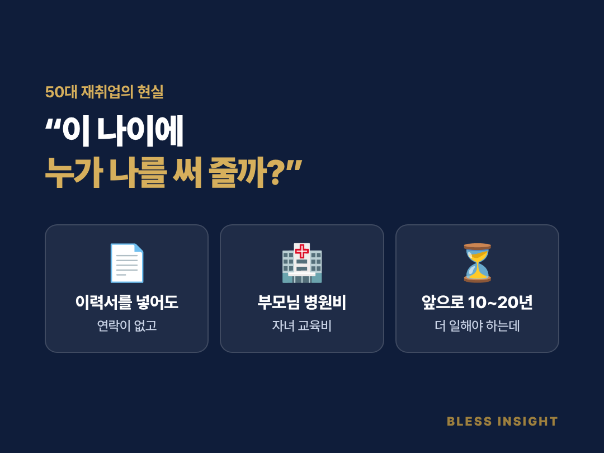
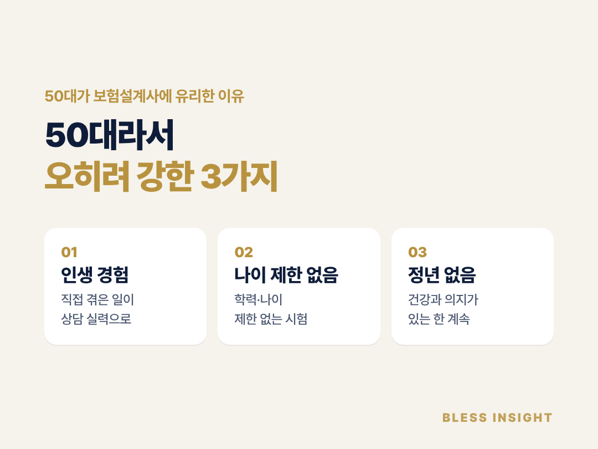
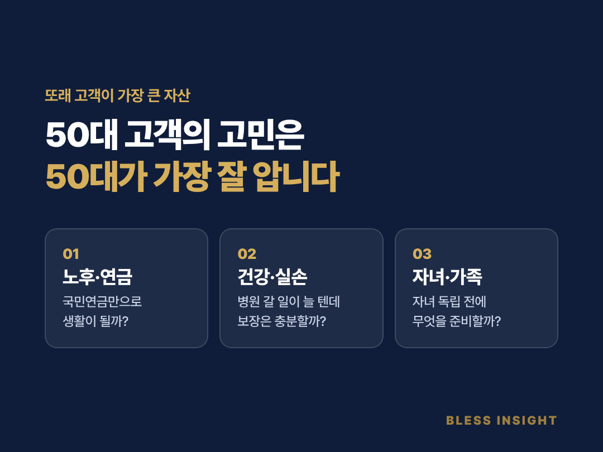
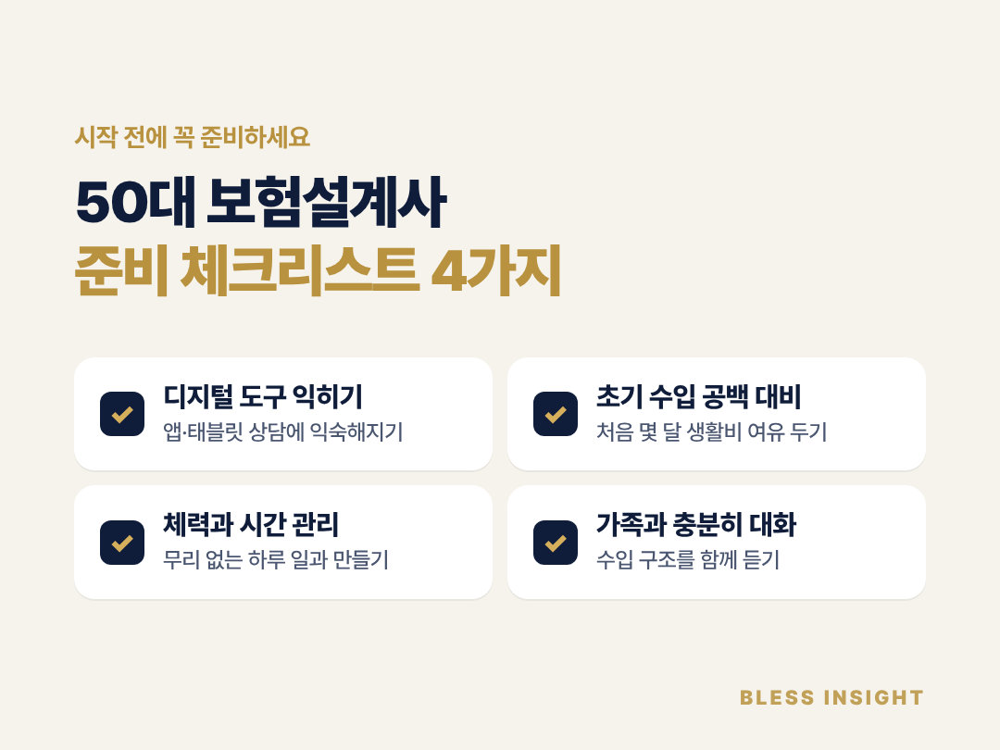
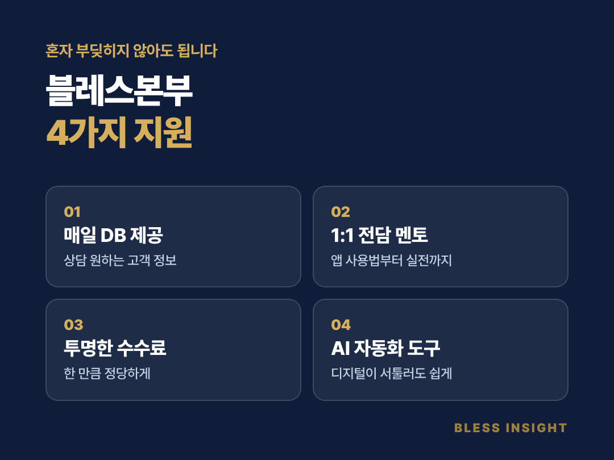

# 50대 재취업, 보험설계사로 다시 시작할 수 있을까?

> **50대도 보험설계사로 충분히 다시 시작할 수 있습니다.** 보험설계사 자격시험에는 나이 제한이 없고, 50대가 겪어 온 인생 경험은 또래 고객과 상담할 때 큰 신뢰가 됩니다. 다만 디지털 도구 사용, 초기 수입 공백, 체력 관리는 미리 준비해야 합니다. 혼자보다는 교육과 고객 연결을 지원하는 곳에서 시작하는 것이 좋습니다.

## "이 나이에 누가 나를 써 줄까?"

퇴직하고 나니 하루가 길어졌습니다.
이력서를 넣어 봐도 연락이 잘 오지 않고,
면접까지 가도 "나이가 좀…"이라는 말이 돌아옵니다.

그런데 자녀 교육비, 부모님 병원비, 내 노후 준비까지
돈 들어갈 곳은 오히려 늘어납니다.

**"앞으로 10년, 20년은 더 일해야 하는데 뭘 할 수 있을까?"**
같은 고민을 하는 50대가 정말 많습니다.

## 50대가 보험설계사에 유리한 3가지 이유

### 1. 인생 경험이 곧 상담 실력입니다

보험은 결국 인생의 큰 사건과 연결돼 있습니다.
결혼, 출산, 자녀 교육, 부모님 병환, 퇴직까지.
50대는 이걸 직접 겪어 본 사람들입니다.

고객이 "부모님 간병비가 걱정돼요"라고 말할 때,
책에서 배운 설명이 아니라 **내 경험으로 공감**할 수 있습니다.

### 2. 나이 제한이 없습니다

보험설계사 자격시험에는 학력이나 나이 제한이 없습니다.
보통 2~4주 정도 준비하면 합격할 수 있는 수준입니다.
서류 단계에서 나이 때문에 떨어질 걱정이 없습니다.

### 3. 정해진 정년이 없는 일입니다

회사원은 정년이 되면 일을 그만둬야 합니다.
보험설계사는 회사와 위촉 계약을 맺고 일하는 구조라,
**건강과 의지가 있는 한 오래 일할 수 있습니다.**

## 또래 고객이 가장 큰 자산입니다

50대 고객의 고민은 50대 설계사가 가장 잘 압니다.

- **노후·연금**: "국민연금만으로 생활이 될까?"
- **건강·실손**: "이제 병원 갈 일이 많아질 텐데 보장이 충분할까?"
- **자녀·가족**: "자녀 독립 전에 무엇을 준비해 줘야 할까?"

같은 시기를 지나는 사람이 하는 말은 무게가 다릅니다.
20~30대 설계사가 따라오기 어려운 50대만의 강점입니다.

## 시작 전에 꼭 준비하세요

솔직하게 말씀드리면, 50대의 새 출발이 쉽지만은 않습니다.

**① 디지털 도구 익히기**
요즘 보험 상담은 휴대폰 앱과 태블릿으로 많이 이뤄집니다.
처음엔 낯설어도, 배우면 금방 익숙해집니다.

**② 초기 수입 공백 대비**
고정급이 아니라 성과에 따라 수입이 정해지는 구조입니다.
처음 몇 달은 생활비 여유를 두고 시작하는 것이 마음 편합니다.

**③ 체력과 시간 관리**
상담 일정은 내가 정할 수 있습니다.
무리하지 않는 하루 일과를 처음부터 만들어 두세요.

**④ 가족과 충분히 이야기하기**
새로운 일을 시작하는 만큼 가족의 응원이 큰 힘이 됩니다.
수입 구조와 지원 내용을 함께 들어 보는 것을 추천합니다.

## 블레스본부는 이렇게 지원합니다

50대에게 가장 필요한 건 **혼자 부딪히지 않아도 되는 환경**입니다.

- **매일 DB 제공**: 메디컬DB, 보장분석DB 등 상담을 원하는 고객 정보를 매일 제공합니다
- **1:1 전담 멘토링**: 보험 기초부터 실전 상담까지 전담 멘토가 함께합니다
- **투명한 수수료 구조**: 내가 한 만큼 정당하게 받을 수 있습니다
- **AI 자동화 도구**: 고객 관리와 보장 분석을 AI가 도와 디지털이 서툴러도 따라올 수 있습니다

## 자주 묻는 질문 (FAQ)

**Q1. 50대 후반인데 지금 시작해도 늦지 않을까요?**
A. 보험설계사는 나이 제한이 없고 정년이 정해진 일이 아닙니다. 50대 후반에 시작해 오래 활동하는 분들도 있습니다.

**Q2. 컴퓨터나 스마트폰을 잘 못 다뤄도 괜찮을까요?**
A. 처음에는 대부분 서툴러합니다. 블레스본부에서는 전담 멘토가 앱 사용법부터 하나씩 알려 드립니다.

**Q3. 영업을 해 본 적이 없는데 할 수 있을까요?**
A. 상담을 원하는 고객 정보(DB)를 제공받아 시작하기 때문에, 처음부터 모르는 사람에게 연락을 돌릴 필요가 없습니다. '판매'보다 '상담'으로 생각하시면 됩니다.

**Q4. 퇴직금이나 연금을 받으면서 일해도 되나요?**
A. 일반적으로 함께 할 수 있습니다. 다만 국민연금을 받는 중이라면 소득에 따라 연금액이 조정될 수 있으니, 국민연금공단에 한 번 확인해 보세요.

## 마무리

50대는 무언가를 끝내는 나이가 아니라, 지금까지의 경험을 다른 사람을 돕는 데 쓸 수 있는 나이입니다.
지금 고민 중이라면, 먼저 편하게 상담부터 받아 보세요.

---

**50대의 새로운 시작, 블레스본부가 함께하겠습니다.**

📌 카카오 오픈채팅으로 상담하기
📌 블레스본부 채용 안내: [bless-insight-recruit.netlify.app](https://bless-insight-recruit.netlify.app)

<!--
title: 50대 재취업, 보험설계사로 다시 시작할 수 있을까?
description: 50대 재취업으로 보험설계사를 고민하고 계신가요? 50대가 유리한 3가지 이유와 시작 전 꼭 준비할 4가지를 정리했습니다.
tags: 50대재취업, 50대일자리, 50대직업추천, 중장년재취업, 퇴직후재취업, 인생2막, 50대여성재취업, 50대남성재취업, 은퇴후일자리, 정년없는직업, 50대보험설계사, 보험설계사나이제한, 보험설계사시작, 보험설계사자격시험, 보험설계사현실, 보험설계사수입, 보험설계사되는법, 보험설계사채용, 보험설계사모집, 보험설계사DB, 노후준비, 50대부업, 시니어일자리, 블레스본부
카테고리: 경력단절·재취업
※ 키워드 검색량은 아직 조사하지 않음 (업리카 연결 후 확인 필요)
-->
